**SENG 438 - Software Testing, Reliability, and Quality**

**Lab. Report #3 – Code Coverage, Adequacy Criteria and Test Case Correlation**

| Group: 3                  |
|---------------------------|
| Student 1 Ahmed Abbas     |   
| Student 2 Rimal Rizvi     |   
| Student 3 Mariyah Malik   |   
| Student 4 Macayla Konig   | 

(Note that some labs require individual reports while others require one report
for each group. Please see each lab document for details.)

# 1 Introduction

The primary goal of this lab is to familiarize ourselves with the principles of white box testing through the JUnit framework. White box testing, also known as clear box testing, structural testing, or glass box testing, involves testing the internal structures/workings of an application, as opposed to black box testing which tests the functionality without any knowledge of internal implementations.

JUnit is a popular unit testing framework in Java, providing an efficient way to create and run repeatable tests. It is an essential tool for practicing white box testing, as it allows developers to write tests that can cover individual units of code, such as methods or classes, ensuring that each part functions as expected.

Through employing white box testing strategies and utilizing coverage tools, you can:

- Ensure that all possible paths are tested, including branches, loops, and exceptions.
- Identify untested parts of the code, enabling targeted improvements to the test suite.
- Improve the design and maintainability of the code by refactoring with testability in mind.
- Detect and fix errors at an early stage of the development cycle, reducing the cost and effort of fixing bugs later.
- Enhance our understanding of the software’s internal workings, leading to more efficient and effective testing.

In summary, this lab aims to equip us with the knowledge and skills to implement through and effective white box testing strategies using the JUnit framework and coverage tools. This approach not only verifies the functionality and reliability of our code at the unit level but also provides a comprehensive assessment of our test suite’s coverage, guiding us towards achieving a higher quality of software product.

# 2 Manual data-flow coverage calculations for X and Y methods

## DataUtilities:
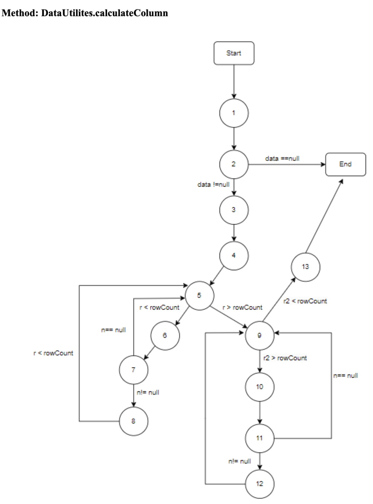

## Def-use Sets Per Statement
|Statement # | Code Line | Def-Use Set |
|------------|-----------|-------------|
| 1          | public static double calculateColumnTotal(Values2D data, int column)| def={data, column} p-use = {} c-use={}|
| 2          | ParamChecks.nullNotPermitted(data, "data"); |  def={} c-use={data} p-use={} |
| 3          | double total = 0.0 | def={total} p-use={} c-use={} |
| 4          | int rowCount = data.getRowCount(); | def={data} c-use={} p-use={rowCount} |
| 5          | for (int r = 0; r < rowCount; r++) | def={r} p-use={} c-use={} |
| 6          | Number n = data.getValue(r, column) | def={n} c-use={r, column, data}, p-use={} |
| 7          | if (n != null) |  def={} c-use={} p-use{n}|
| 8          | total += n.doubleValue(); | def={total} c-use={total, n} p-use={} |
| 9          | for (int r2 = 0; r2 > rowCount; r2++) | def={r2} c-use={r2} p-use={r2, rowCount}|
| 10         | Number n = data.getValue(r2, column) | def={n} c-use={r2, column, data}, p-use={}|
| 11         | if (n != null) | def={} c-use={} p-use{n}|
| 12         | total += n.doubleValue(); | def={total} c-use={total, n} p-use={}|
| 13         | return total; | def={} c-use={total} p-use={}|

## DU-pairs Per Variable
|Variable | DU-pairs |
|---------|----------|
| data |{(1,2), (1,4), (1,6), (1,10)}|
| column | {(1,6), (1,10)}|
| total | {(3,8), (3,12), (3,13), (8,8), (12,12), (8,13), (8,12), (12,13)}|
| rowCount | {(4,5), (4,9)}|
| r | {(5,5), (5,6)}|
| n | {(6,7), (6,8), (10,11), (10,12)}|
| r2 | {(9,9), (9,10)}|

## Test Cases DU Pair Coverage
|Test Method | DU-pairs Covered | DU Coverage |
|------------|------------------|-------------|
| calculateColumnTotalNull() | {(1,2)}| (1/24) = 4.2% |
| firstColumnIndex() | {(1,2), (1,4), (1,6), (3,8), (8,8), (4,5), (5,5), (5,6), (6,7), (6,8), (8,13)} | (11/24) = 45.8% |
| middleColumnIndex() | {(1,2), (1,4), (1,6), (3,8), (8,8), (4,5), (5,5), (5,6), (6,7), (6,8), (8,13)} | (11/24) = 45.8% |
| lastColumnIndex() | {(1,2), (1,4), (1,6), (3,8), (8,8), (4,5), (5,5), (5,6), (6,7), (6,8), (8,13)} | (11/24) = 45.8% |
| outOfBoundsColumnIndex() | {(1,2), (1,4), (1,6), (4,5), (5,5), (5,6), (6,7), (3,13)} | (8/24) = 33.3% |
| calculateColumnTotalPositive() |{(1,2), (1,4), (1,6), (3,8), (8,8), (4,5), (5,5), (5,6), (6,7), (6,8), (8,13)}| (11/24) = 45.8%
| calculateColumnTotalNegative() | {(1,2), (1,4), (1,6), (3,8), (8,8), (4,5), (5,5), (5,6), (6,7), (6,8), (8,13)} | (11/24) = 45.8% |
| calculateColumn_emptyColumn() | {(1,2), (1,4), (1,6), (3,13), (4,5), (5,5), (5,6), (6,7)} | (8/24) = 33.3%

## Coverage
#### coverage = (How many DU pairs were covered) / (Total # of DU pairs) = %
#### coverage =  ( 12 / 24 ) * 100
#### coverage =  50%

## Range:
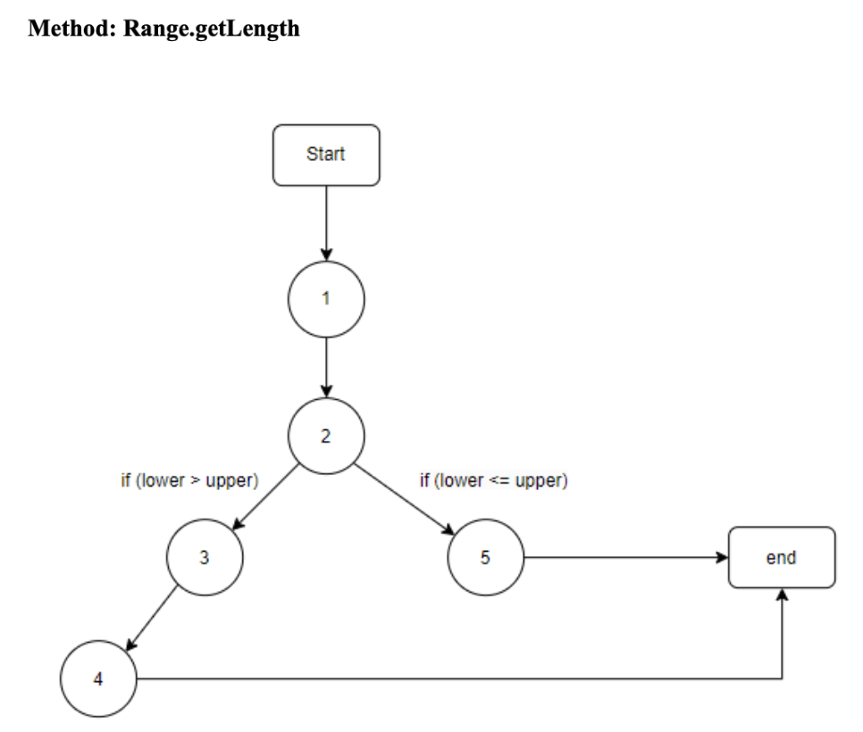

## Def-use Sets Per Statement
|Statement # | Code Line | Def-Use Set |
|------------|-----------|-------------|
| 1          | public double getLength() | def={} p-use ={} c-use={} |
| 2 | if (lower > upper) | def={} p-use ={lower, upper} c-use={} |
| 3 | String msg = "Range(double, double): require lower (" + lower + ") <= upper (" + upper + ")." | def={msg} p-use ={} c-use={lower, upper} | 
| 4 | throw new IllegalArgumentException(msg) | def={} p-use ={} c-use={msg} |
| 5 | return this.upper - this.lower | def={} p-use ={} c-use={upper, lower} |

## DU-pairs Per Variable

|Variable | DU-pairs |
|---------|----------|
| msg | {(3,4)}|

## Test Cases DU Pair Coverage
|Test Method | DU-pairs Covered | DU Coverage |
|------------|------------------|-------------|
| testLengthPositiveNumber() | {}| (0/5) = 0% |
| testLengthZero() | {} | (0/5) = 0% |
| testLengthPositiveInfinity() | {} | (0/5) = 0% |
| testLengthNegativeInfinity() | {} | (0/5) = 0% |

## Coverage
#### coverage = (How many DU pairs were covered) / (Total # of DU pairs) = %
#### coverage =  ( 0 / 5 ) * 100
#### coverage =  0%

# 3 A detailed description of the testing strategy for the new unit test

## Test Plan

The objective of this test plan is to ensure that the test suite for the Range and DataUtilities classes achieve adequate coverage of the code, including statement coverage, branch coverage, and condition coverage.

### Test Coverage Criteria

- Statement Coverage: Ensure that each statement in the source code of the Range and DataUtilities classes is executed at least once.
- Branch Coverage: Ensure that each decision branch in the source code of the Range and DataUtilities classes is exercised at least once.
- Method Coverage: Ensure that all methods in the Range and DataUtilities classes are adequately tested.

### Test Cases

#### Statement Coverage Test Cases

- For each method in the Range and DataUtilities classes, design test cases that use every statement in the method.
- Execute the test cases and ensure that every statement in each method is covered.
- The current statement coverage for Range is 24.4%, and the goal statement coverage is 90%.
- The current statement coverage for DataUtilities is 46.9%, and the goal statement coverage is 90%.

#### Branch Coverage Test Cases

- For each method in the Range and DataUtilities classes, design test cases that traverse every possible decision branch.
- Ensure that the test cases cover both the true and false branches of each decision point.
- Execute the test cases and verify that every decision branch is exercised.
- The current branch coverage for Range is 13.4%, and the goal branch coverage is 70%.
- The current branch coverage for DataUtilities is 32.8%, and the goal branch coverage is 70%.

#### Method Coverage Test Cases

- Ensure that each method in the class is tested completely.
- Develop test cases for functions that have more than one version (function overloading).
- The current method coverage is 60%, and the goal is 90%.
- The current method coverage for Range is 34.8%, and the goal is 60%.

# 4 A high level description of five selected test cases you have designed using coverage information, and how they have increased code coverage

The coverage information identified various branches, statements, and methods missed by our test cases. A major area of concern that was identified was the `equal` function. We developed 5 test cases which covered the functionalities of the `equal(double[][] a, double[][] b)` function. This included: 

- Checking if the function returns true when given equal arrays 
- Checking if the function returns false when given unequal arrays 
- Checking if the function returns true when given two null arrays 
- Checking if the function returns false when given one Null and one valid array 
- Checking if the function returns false when given two arrays of different lengths 

The implementation of these test cases led to a substantial increase in all measured coverage methods, where branch coverage was increased by 17.2%, method coverage by 10%, and line coverage by 10.4%.

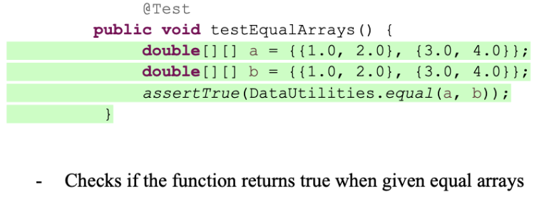
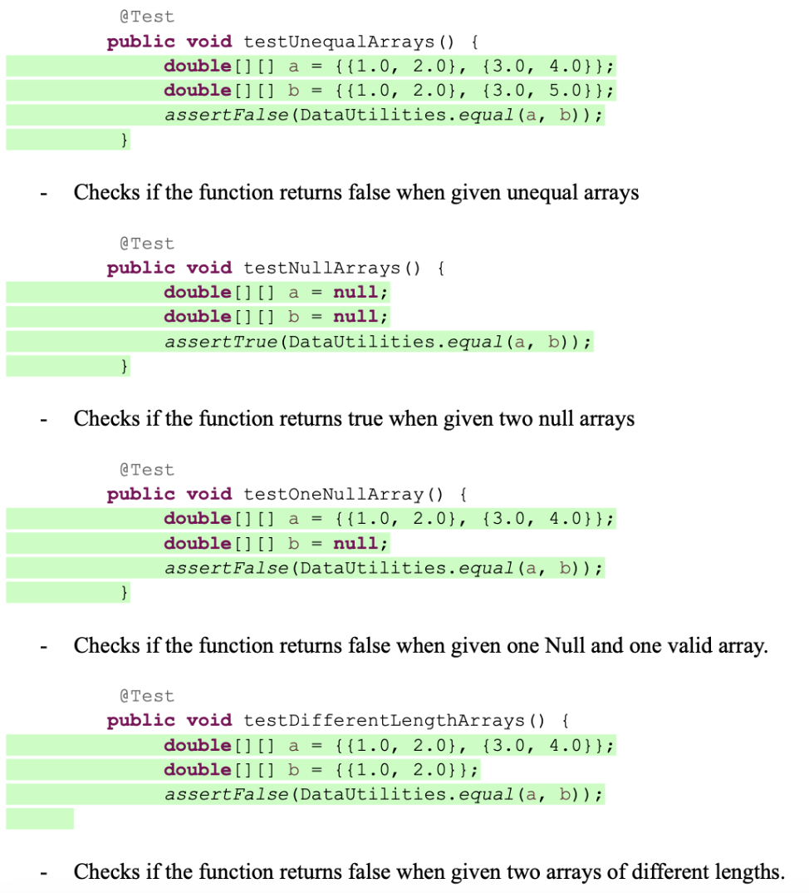

# 5 A detailed report of the coverage achieved of each class and method (a screen shot from the code cover results in green and red color would suffice)

## DataUtilities:

### Before:
#### Statement Coverage: 
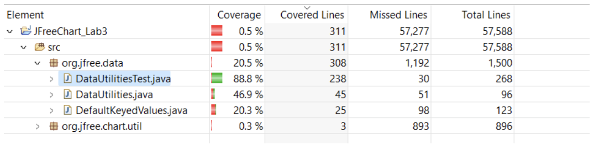
#### Branch Coverage:

#### Method Coverage:
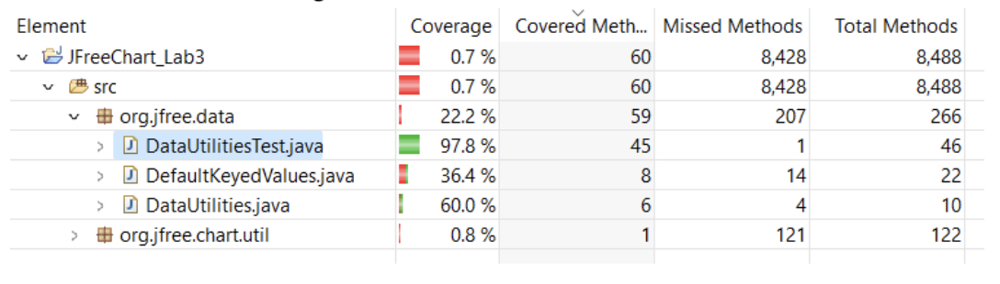
### After:
#### Statement Coverage: 
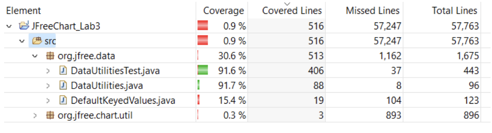
#### Branch Coverage:
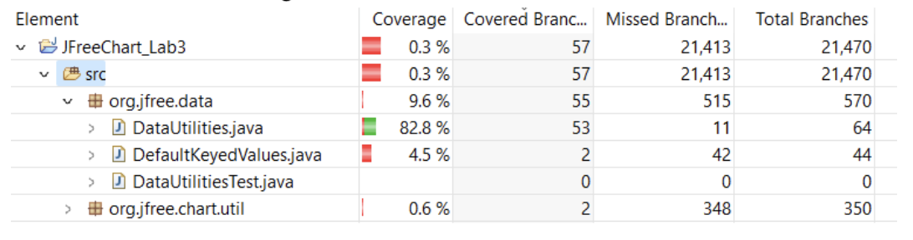
#### Method Coverage:
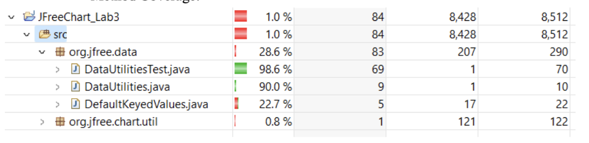

## Range:
    
### Before:
#### Statement Coverage: 
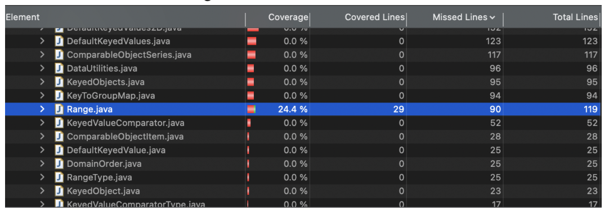
#### Branch Coverage:
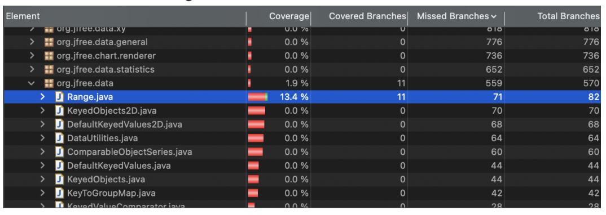
#### Method Coverage:
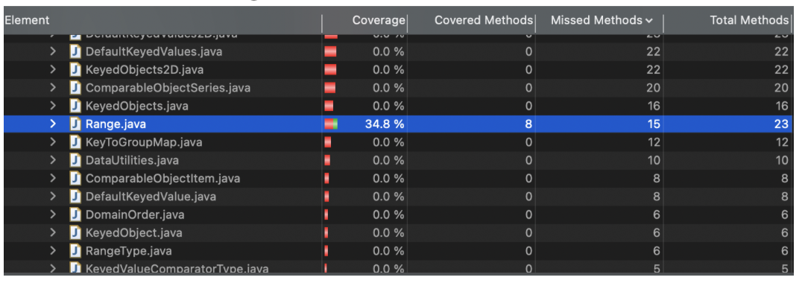
### After:
#### Statement Coverage: 
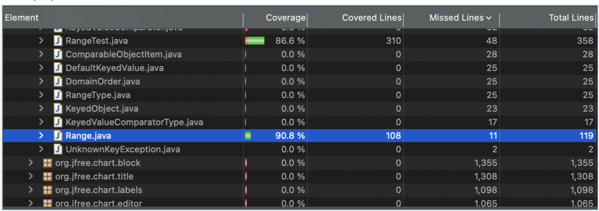
#### Branch Coverage:
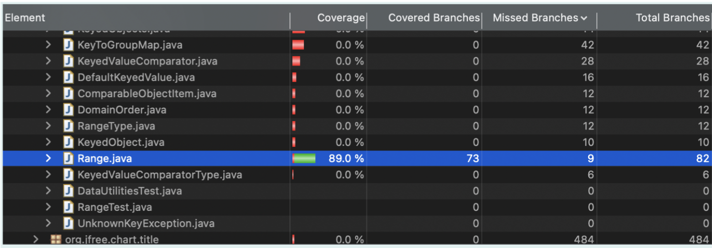
#### Method Coverage:
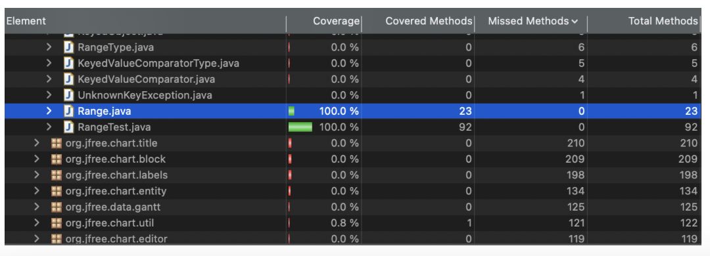

# 6 Pros and Cons of coverage tools used and Metrics you report

| Tools     | Pros                                    | Cons                                |
|-----------|-----------------------------------------|-------------------------------------|
| EclEmma   | - Covers line, branch, and method coverage | - Does not have path and condition coverage |
|           | - No issues with mocking components     | - Difficulties with our configuration |
|           | - Easy to use                           |                                     |
| Codecover | - Theoretically has condition coverage  | - Does not have condition coverage  |
| Lover     | - Seamless integration with Range       | - Does not work well with mocking   |

# 7 A comparison on the advantages and disadvantages of requirements-based test generation and coverage-based test generation.

| Test                      | Advantages                    | Disadvantages             |
|---------------------------|-------------------------------|---------------------------|
| Requirements-based test   | - All code paths are tested   | - Requires tools          |
|                           | - Effectively using existing test cases | - Multiple coverage tests |
|                           | - uses black-box testing      | - limits converge since only some tests are performed.|  
|                           | - access to code is not       | - inefficient as some testers may not have software knowledge |
|                           |   required                    | |
|                           | - identifies the differences between developers and users and so removing any bias towards code’s functionality  | |
| Coverage-based test       | - easier to plan              | - can miss sections of code   |
|                           | - easier to design tests      |  - requires high level knowledge of SUT |
|                           | - can effectively find errors and problems in code logic| - requires access to code |
|                           | - uses white box testing      |    |

# 8 A discussion on how the team work/effort was divided and managed

In our team, consisting of Ahmed, Macayla, Mariyah, and Rimal, we divided the tasks of the lab based on each member's strengths and interests. Ahmed took the lead in familiarizing the team with the testing tools and setting up the project in Eclipse. Macayla focused on researching and selecting the appropriate code coverage tool for the assignment. Mariyah and Rimal worked together on developing the test plan and designing new test cases to achieve the required coverage criteria. Throughout the assignment, we maintained open communication and held regular meetings to track progress and address any issues we faced.

# 9 Any difficulties encountered, challenges overcome, and lessons learned from performing the lab

During the lab, we encountered challenges with integrating the selected code coverage tool with our Eclipse environment due to compatibility issues. However, through collaborative troubleshooting and online research, we were able to resolve the issues and successfully integrate the tool into our workflow. Additionally, designing test cases to achieve specific coverage criteria was a challenge, requiring careful consideration of test scenarios and code paths. By working together, we were able to overcome these challenges and gain valuable insights into the complexities of white-box testing and code coverage analysis.

# 10 Comments/feedback on the lab itself

Overall, the lab provided an invaluable learning experience for our team, allowing us to further our understanding of white-box testing principles and techniques. The structured approach to measuring test adequacy through code coverage analysis was particularly enlightening, highlighting the importance of thorough testing and the trade-offs involved in selecting coverage criteria. Additionally, the hands-on nature of the assignment enabled us to apply theoretical concepts in a practical setting, reinforcing our learning and skill development. We worked well as a team and believe that the knowledge gained from this lab will benefit us in future software testing endeavors.
